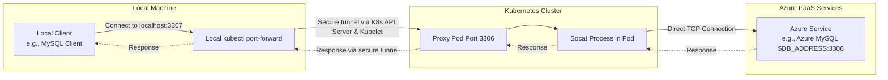

# KubeTunnel

KubeTunnel helps you access Azure PaaS services that are not directly accessible from your local machine, by creating tunnels through a proxy pod in your AKS cluster.

## How It Works

The following diagram illustrates how KubeTunnel creates a secure connection to Azure PaaS services:



## Prerequisites

- Access to an AKS cluster
- A proxy pod deployed in the cluster with access to Azure services
- `kubectl` configured with proper access to the cluster
- Local machine with Go installed (for development)

## Quick Start

1. Create your configuration file:
   - Default location: `./config/sites.yaml`
   - Or specify custom location using `--config` flag
2. Run the tool:
   ```bash
   # Using default config file (./config/sites.yaml)
   kubetunnel [site-name] --services mysql,redis

   # Using custom config file location
   kubetunnel --config /custom/path/to/sites.yaml [site-name] --services mysql,redis
   ```

## Configuration

Example configuration file (`sites.yaml`):
```yaml
sites:
   prod-us:
      proxy: app=xxx-proxy
      namespace: 
      kubeContext: 
      services:
         mysql:
            defaultPort: 3306
            localPort: 13306  
            endpoint: 
         redis:
            defaultPort: 6379
            localPort: 16379 
            endpoint: 

```

See the `config/sites.yaml.example` for more configuration examples.

## Features

- Connect to multiple Azure services simultaneously
- Support for various Azure PaaS services (MySQL, Redis, etc.)
- Secure tunneling through Kubernetes API
- Automatic cleanup on program termination

## Usage

Basic usage:
```bash
# Forward all services for all sites
kubetunnel

# Forward specific services for a site
kubetunnel dev-site --services mysql,redis

# Use custom config file
kubetunnel --config /path/to/config.yaml dev-site
```
